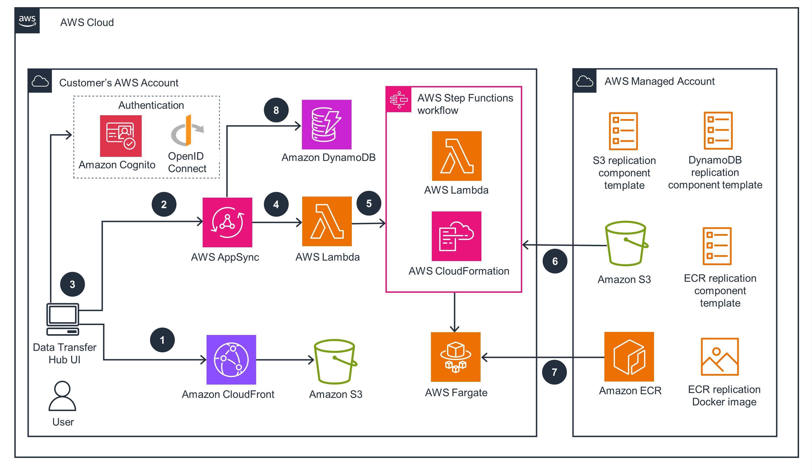

# Data Transfer Hub for Amazon ECR and S3

_Note_: If you have already deployed this Guidance, refer to the [User Guide](docs/UserManual.md).

Data Transfer Hub is a secure, reliable, scalable, and trackable Guidance offers a unified user experience that 
allows you to easily create and manage different types of data transfer tasks from different sources to 
Amazon Web Services cloud-native services. You can launch this Guidance and start to replicate data within a few minutes.

With Data Transfer Hub, you can perform any of the following tasks:
- Transfer Amazon S3 objects between AWS China Regions and AWS Regions.
- Transfer Amazon S3 objects between AWS GovCloud and AWS Regions.
- Transfer data from other cloud providers’ object storage services (including Alibaba
Cloud OSS, Tencent COS, Qiniu Kodo, and S3 Compatible storage) to Amazon S3.
- Transfer Amazon ECR images between AWS China Regions and AWS Regions.
- Transfer container images from public container registries (e.g., Docker Hub, Google
gcr.io, Red Hat Quay.io) or from local development environment to Amazon ECR.
- Bulk Transfer container images from on-premise to Amazon ECR using PUSH mechanism.

You will be responsible for your compliance with all applicable laws in respect of your data transfer tasks.

## Features

- [x] Authentication (Cognito User Pool, OIDC)
- [x] Self-service User Interface
- [x] CDK Deployment
- [x] CloudFormation Deployment
- [x] S3 Plugin
    - [x] Amazon S3 object copy between AWS China Regions and AWS Regions.
    - [x] Amazon S3 object copy between AWS GovCloud and AWS Regions.
    - [x] Data transfer from Alibaba Cloud OSS to Amazon S3
    - [x] Data transfer from Tencent COS to Amazon S3
    - [x] Data transfer from Qiniu Kodo to Amazon S3
    - [x] Support data transfer with Metadata
    - [x] Support S3 Events to trigger data transfer
    - [x] Use TCP BBR to improve network performance.
    - [x] Support transfer from Amazon S3 Compatible Storage
- [x] ECR Plugin
    - [x] Amazon ECR images copy between AWS Regions and AWS China Regions
    - [x] Public docker registry to AWS ECR images copy
    - [x] Copy all images or only selected Images
    - [x] Support One-time images copy
    - [x] Support Incremental images copy
- [x] Bulk Migration from on-premise to ECR (PUSH Mechanism)
    - [x] Supports multiple implementation methods (Python script, Terraform, Ansible, Puppet etc)
    - [x] Creation of Repositories if it’s not already present in ECR, verification of duplicate Repositories & images
    - [x] Preserve existing image tags, labels and metadata
    - [x] Handles authentication, network transfer, overwrite protection and validation of migrated images
    - [x] Seamless integration with other AWS container services like ECS, EKS and Fargate

## Architecture



1.	Amazon Simple Storage Service (Amazon S3) stores static web assets (such as the frontend UI), which are made available through Amazon CloudFront.
2.	AWS AppSync GraphQL provides backend APIs.
3.	Users are authenticated by either Amazon Cognito user pools (in AWS Standard Regions) or by an OpenID connect provider (in AWS China Regions) such as Authing or Auth0.
4.	AWS AppSync runs AWS Lambda to call backend APIs.
5.	Lambda starts an AWS Step Functions workflow that uses AWS CloudFormation to start or stop or delete Amazon Elastic Container Registry (Amazon ECR) or the Amazon S3 plugin template.
6.	A centralized S3 bucket hosts plugin templates.
7.	The Guidance also provisions an Amazon Elastic Container Service (Amazon ECS) cluster that runs the container images used by the plugin template, and the container images are hosted in Amazon ECR.
8.	Amazon DynamoDB stores data transfer task information. 


Available Plugins:
* [S3 Plugin](./docs/S3_PLUGIN.md)
* [ECR Plugin](./docs/ECR_PLUGIN.md)
* [ECR PUSH Mechanism](./docs/ECR_PUSH_MECHANISM.md)


## Cost

You are responsible for the cost of the AWS services used while running this Guidance, which can vary based on whether you are transferring Amazon S3 objects or Amazon ECR images.
The Guidance automatically deploys an additional Amazon CloudFront Distribution and an Amazon S3 bucket for storing the static website assets in your account. You are responsible for the incurred variable charges from these services. For full details, refer to the pricing webpage for each AWS service you will be using in this Guidance.
The following examples demonstrate how to estimate the cost. Two example estimates are for transferring Amazon S3 objects, and one is for transferring ECR images.

### Cost of an Amazon S3 transfer task

For an Amazon S3 transfer task, the cost can vary based on the total number of files and the average file size.
 
Example 1: As of this revision, transfer 1 TB of S3 files from AWS Oregon Region (us-west-2) to AWS Beijing Region (cn-north-1), and the average file size is 50MB.
Total files: ~20,480

Average speed per Amazon EC2 instance: ~1GB/min Total Amazon EC2 instance hours: ~17 hours

| AWS service  | Dimensions | Cost [USD] |
| ----------- | ------------ | ------------ |
| Amazon EC2 | $0.0084 per hour (t4g.micro) | $0.14 |
|Amazon S3 |	~ 12 GET requests + 10 PUT request per file GET: $0.0004 per 1000 request PUT: $0.005 per 1000 request | $0.12 |
| Amazon DynamoDB |	~2 write requests per file $1.25 per million write |	$0.05 |
| Amazon SQS |	~2 request per file $0.40 per million requests |	$0.01 |
| Data Transfer Out	| $0.09 per GB	| $92.16 |
| Others (For example, CloudWatch, Secrets Manager, etc.) | | ~ $1 |
| |	TOTAL |	~ $94.48 |

### Cost of an Amazon ECR transfer task

For an Amazon ECR transfer task, the cost can vary based on network speed and total size of ECR images.
Example 2: As of this revision, transfer 27 Amazon ECR images (~3 GB in total size) from AWS Ireland Region (eu-west-1) to AWS Beijing Region (cn-north-1). The total runtime is about 6 minutes.

| AWS service  | Dimensions | Cost [USD] |
| ----------- | ------------ | ------------ |
| AWS Lambda | $0.0000004 per 100ms | $0.000072(35221.95 ms) |
| AWS Step Functions |	$0.000025 per state transition (~ 60 state transitions per run in this case) |	$0.0015 |
| Fargate |	$0.04048 per vCPU per hour $0.004445 per GB per hour (0.5 vCPU 1GB Memory) | $0.015 (~ 2200s) |
| Data Transfer Out	| $0.09 per GB | $0.27 |
| Others (for example, CloudWatch, Secrets Manager, etc.) | Almost 0 |	$0 |
| | TOTAL |	~ $0.287 |

## Prerequisites

Please install the following dependencies on your local machine.

* nodejs 12+
* npm 6+
* Docker

You need CDK bootstrap v4+ to deploy this application. To upgrade to latest CDK bootstrap version. Run
```
cdk bootstrap --cloudformation-execution-policies arn:aws:iam::aws:policy/AdministratorAccess
```

Please make sure Docker is running on your local machine.

## Deployment Steps via AWS CDK

> **Time to deploy:** Approximately 15 minutes.

### Build the Web Portal assets

The Web Portal is being built with React and [AWS Amplify](https://docs.amplify.aws/) framework.
```
cd source/portal
npm install
npm run build
```
The output assets will be located in `source/portal/build` directory.

### CDK Synth & CDK Deploy
_Note_: Please make sure Docker is running.

```
cd ../constructs
npm install 
npm run build
npx cdk synth
npx cdk deploy --parameters AdminEmail=<your-email-address>
```

The only parameter you should specify is the default user's email address. It will serve as the username when login into the web portal.

### Login into the Data Transfer Hub Portal

An email containing the temporary password will be sent to the provided email. Note the password for later use.

1. Open the CloudFormation Console, and choose the deployed stack.
1. Select the **Output** of the CloudFormation stack, and find the **PortalUrl**.
1. Open the portal in your browser.
1. Sign in with the **AdminEmail** and the temporary password.
1. Set a new password.
1. Verify your email address and turn on account recovery (optional).
1. The page redirects to the login page. 
1. Input the **AdminEmail** and the new password.

## User Manual

Create your first data transfer task, For the complete user guide, refer to
[User Guide](docs/UserManual.md) for more information.

## Uninstall the Guidance

You can uninstall the Data Transfer Hub Guidance from the AWS Management Console or by using the AWS Command Line Interface. You must manually stop any active transfer tasks before uninstalling.

### Using the AWS Management Console

1.	Sign in to the AWS CloudFormation console.
2.	On the Stacks page, select this Guidance’s installation stack.
3.	Choose Delete.

### Using AWS Command Line Interface

Determine whether the AWS Command Line Interface (AWS CLI) is available in your environment. For installation instructions, refer to [What Is the AWS Command Line Interface](https://docs.aws.amazon.com/cli/latest/userguide/cli-chap-welcome.html) in the AWS CLI User Guide. After confirming that the AWS CLI is available, run the following command.

```
$ aws cloudformation delete-stack --stack-name <installation-stack-name>
```
 ### Deleting the Amazon S3 buckets

 This Guidance is configured to retain the Guidance-created Amazon S3 bucket (for deploying in an opt-in Region) if you decide to delete the AWS CloudFormation stack to prevent accidental data loss. After uninstalling the Guidance, you can manually delete this S3 bucket if you do not need to retain the data. Follow these steps to delete the Amazon S3 bucket.
1.	Sign in to the Amazon S3 console.
2.	Choose Buckets from the left navigation pane.
3.	Locate the <stack-name> S3 buckets.
4.	Select the S3 bucket and choose Delete.

To delete the S3 bucket using AWS CLI, run the following command:
```
$ aws s3 rb s3://<bucket-name> --force
```

## FAQ

**Q. Which are the supported Regions of this Guidance?**</br>
Please refer to [Supported Regions](https://awslabs.github.io/data-transfer-hub/en/plan-deployment/regions/).

**Q. If I want to copy data from U.S. Regions to China Regions, where should I deploy the Guidance?**</br>
You can either deploy the Guidance in U.S. Regions or deploy the Guidance in China Regions. 

**Q. Can I deploy the Guidance in AWS Account A, and transfer Amazon S3 objects from Account B to Account C?**</br>
Yes. In this case, you will need to store the [AccessKeyID and SecretAccessKey](https://docs.aws.amazon.com/general/latest/gr/aws-sec-cred-types.html#access-keys-and-secret-access-keys) 
for Account B and C in the [Secrets Manager](https://docs.aws.amazon.com/secretsmanager/latest/userguide/intro.html) 
of Account A.

## More Resources

* [How to customize this Guidance and build your own distributable?](./docs/build-your-own-distributable.md)
* [Deploy this Guidance via AWS CDK](./docs/deploy-via-cdk.md)
* [Data Transfer Hub S3 Plugin](./docs/S3_PLUGIN.md)
* [Data Transfer Hub ECR Plugin](./docs/ECR_PLUGIN.md)
