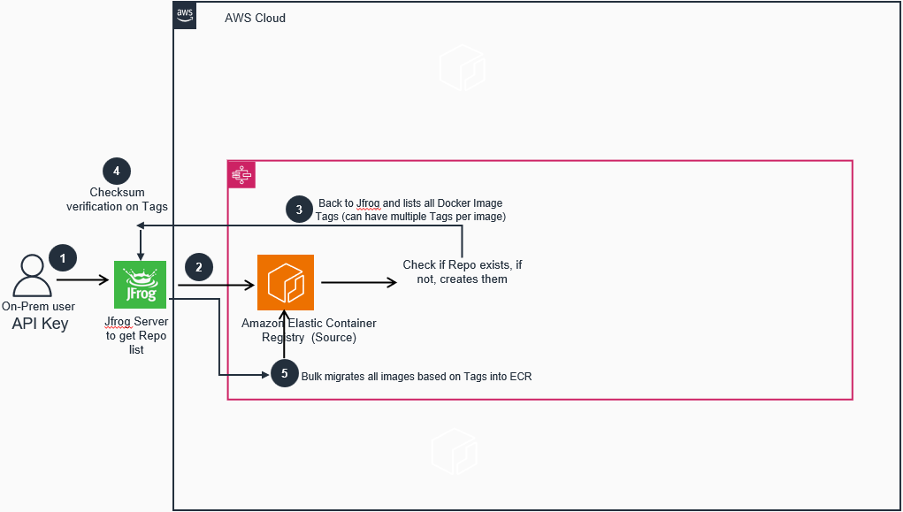

# Data Transfer Hub - ECR PUSH MECHANISM

## Table of contents
* [Introduction](#introduction)
* [Architecture](#architecture)
* [Deployment](#deployment)
* [FAQ](#faq)


## Introduction

[Data Transfer Hub - ECR PUSH MECHANISM](https://github.com/awslabs/data-transfer-hub) is a solution to efficiently transfer all of their repositories and container images in bulk from on-premise to Amazon ECR. It supports multiple implementation methods, including Python script, Terraform modules, and integration with automation tools like Ansible and Puppet. 

The following are the planned features of this plugin.

- Ability to bulk migrate container images from on-premise repository to Amazon ECR 
- Supports multiple implementation methods (Python script, Terraform, Ansible, Puppet etc) 
- Handles authentication, network transfer, overwrite protection and validation of migrated images 
- Creation of Repositories if it’s not already present in ECR, verification of duplicate Repositories & images 
- Offers detailed logging and ability to resume interrupted transfers 
- Seamless integration with other AWS container services like ECS, EKS and Fargate 
- Preserve existing image tags, labels and metadata


## Architecture



Solution makes an API call to on-prem Jfrog Repository and list all user repos.

Solution makes a second call to Amazon ECR using credentials configured by AWS CLI and checks if list of on-prem repos exists in ECR, if not creates them.

Comes back to on-prem repo and tally all docker image tags in all repos.

Checksum verification of tags in ECR, if tag exist in ECR and checksum matches, it is left alone.

Migrates all docker images in bulk to ECR

Solution can be repeated


## Deployment

### Deployment Steps via CMD

1. Need Python 3 environment
2. Pull the codes from Gitlab, edit the script and provide OS environment variables as described below
3. Install AWS Config if you haven't already
4. Configure ECR credentials, username, access key and region with AWS Config
5. Source registry is your On-Prem Jfrog repository
6. Target Registry is your Amazon ECR repository
7. Use Jrog api uri not the url
8. This script is tested with username and passwd for jfrog, you can use jfrog api key instead of passwd, follow steps 9 and 10 to use artifactory_api_key
9. Comment this line #login_cmd = f"docker login {config.source_registry} -u {config.artifactory_user} -p {config.artifactory_pass}"
10. uncomment this line login_cmd = f"docker login {config.source_registry} -u {config.artifactory_user} -p {config.artifactory_api_key}"
11. chmod +x <codes you have downloaded from Gitlab)
12. Execute code (./<executable codes>  or python <executable codes>)
13. Log file is produced in /tmp dir "/tmp/ECR-Script.log"

### Deployment Steps via IAC Terraform

1. Prior to Terraform execution, complete steps 1 - 10 as needed
2. Sample codes below for Terraform local executor
```
 resource "null_resource" "example" {
   provisioner "local-exec" {
   command = "python /path/to/your/script.py"
   }
 }
```
3. Use this link for Terraform examples  https://developer.hashicorp.com/terraform/language/resources/provisioners/remote-exec

### Deployment Steps via Automation tools i.e. Ansible

1. Prior to Terraform execution, complete steps 1 - 10 as needed
2. See below examples to run the codes with Ansible
```
      - name: Run a script with arguments (using 'cmd' parameter)
                  ansible.builtin.script:
                    cmd: /some/local/script.sh --some-argument 1234
```
3. Use this link for Ansible examples  https://docs.ansible.com/ansible/latest/collections/ansible/builtin/script_module.html


## FAQ

**Q**: What are the prerequisites for using the tool?

**A**: Valid AWS credentials, source repository access, and standard Python environment.

**Q**: Is this tool available for all AWS regions?

**A**: Yes, the tool supports all regions where ECR is available.

**Q**: Can the tool migrate images from cloud-based repositories?

**A**: The current version of the tool is designed for migrating from on-premises repositories and other cloud-based 71repositories (like ACR for Azure, Artifact for GCP, Github, Gitlab) to Amazon ECR.

**Q**: How does this tool integrate with other AWS services?

**A**: Once images are migrated to Amazon ECR, customers can seamlessly use them with other AWS container 67services such as Amazon ECS, Amazon EKS, and AWS Fargate. This integration allows for a smooth transition to 68cloud-native container orchestration and serverless container computing.

